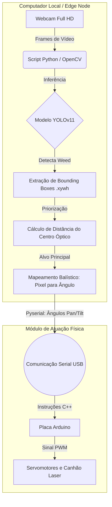

# Helios 


>**Helios** é um sistema integrado de Visão Computacional e Robótica (*Edge Computing*) focado na agricultura de precisão. O projeto utiliza inteligência artificial para identificar ervas daninhas em tempo real e converte as coordenadas visuais em ângulos cinemáticos (Pan/Tilt) para o direcionamento físico de um mecanismo atuador (laser/servomotores) via Arduino.

---

##  Arquitetura do Sistema

O fluxo do projeto conecta a percepção visual do modelo de IA à atuação física no mundo real. O processo é executado localmente (Edge Node) para garantir baixa latência e alta precisão.



---

##  Principais Funcionalidades

* **Detecção Otimizada:** Utiliza um modelo YOLOv11 treinado especificamente para diferenciar entre `Crop` (Cultura) e `Weed` (Erva Daninha), com +90% de mAP50.
* **Priorização Geométrica:** Implementação matemática via Teorema de Pitágoras (`math.hypot`) que calcula e prioriza o abatimento da planta mais próxima ao centro da câmera, evitando movimentos bruscos da estrutura mecânica.
* **Mapeamento Balístico:** Função de interpolação linear (`map_range`) em Python que converte a matriz bidimensional de pixels (ex: 640x480) na matriz de ângulos dos servomotores (0° a 180°).
* **Processamento de Borda:** Código otimizado (`imgsz=320`) para rodar com framerates altos (>15 FPS) em CPUs locais, sem a necessidade de GPUs dedicadas durante a atuação.

---

## Dataset e Pesos do Modelo

Para manter o repositório leve e ágil (evitando os limites do Git LFS), o dataset completo de imagens utilizado no treinamento da rede neural está hospedado externamente na plataforma Kaggle.

 **Acesse o banco de dados aqui:** [Weeds Detection Dataset - Kaggle](https://www.kaggle.com/datasets/swish9/weeds-detection)

*(Os pesos finais gerados após o treinamento (`best.pt`) devem ser baixados e alocados na raiz deste projeto para o funcionamento do script Edge).*

---

## Instalação e Execução

1. Clone este repositório:
```bash
git clone [https://github.com/vrenzd/helios.git](https://github.com/vrenzd/helios.git)
cd helios

```


2. Crie e ative um ambiente virtual e instale as dependências:
```bash
pip install ultralytics opencv-python jupyter pyserial

```


**3. Certifique-se de que o arquivo de pesos `best.pt` está na raiz do diretório.**
4. Execute o notebook ou script principal responsável pela inferência e comunicação serial.
